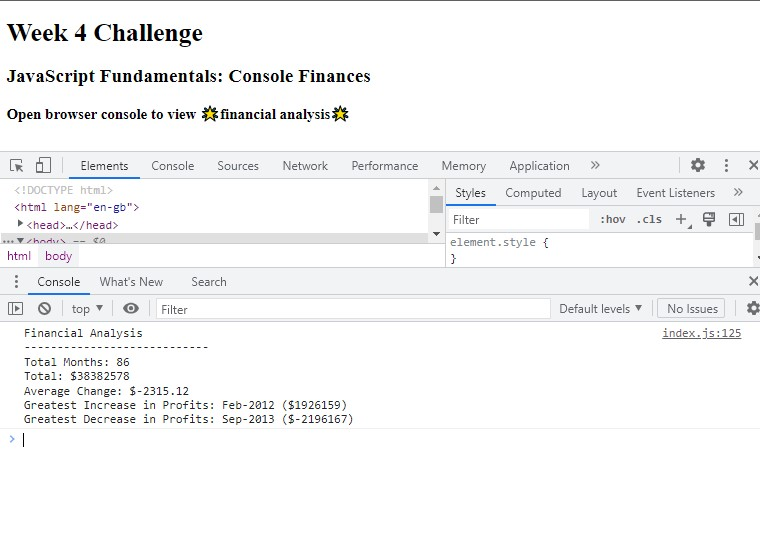

# Week-4 Challenge - Console Finances

## Description

As a review of the materials we learnt in our fourth week, our **Week 4 Challenge** will test our skills in basic JavaScript and logic by having us analyze the financial records of a company by creating codes.

In this web application, I have applied the following skills:

>01. JavaScript
>02. Google-fu
>03. Google-fu
>04. Google-fu
>05. Maybe some tears
>06. Google-fu

## Installation

N/A

## Usage 

Open browser console to view 🌟financial analysis🌟

Console Finances Website:
https://damnsemicolon.github.io/console-finances-shannon/

Screenshot of deployed website:

## Credits

Philip Howley (Instructor) 
Nic Catania (TA) 
Pod-4 mates 
Myself

## License

## Badges

